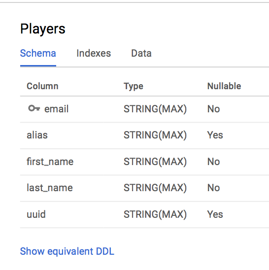

## Preliminary requirements
* Stackdriver Monitoring and Tracing enabled on your GCP project
* Cloud Spanner also enabled on your account 

### Create the Cloud Spanner schema


### UUID service
```shell
GOOGLE_APPLICATION_CREDENTIALS=<creds.json> go run uuid.go --gcp-id census-demos
```

### Main service
```shell
GOOGLE_APPLICATION_CREDENTIALS=<creds.json> go run uuid.go --gcp-id census-demos --spanner-db demo1
```

### Results
After running the main service you should be able to visit Stackdriver Tracing and visualize
the spans created. If all is well you should see the span for the uuid service included
as a child span of the main service.
